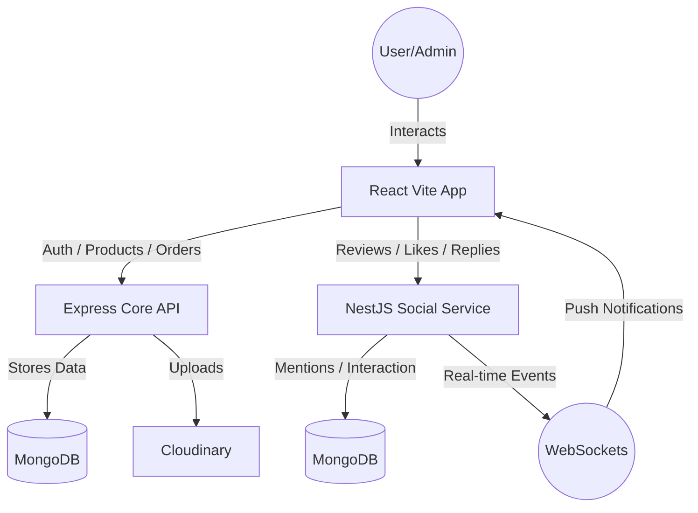

# 🍃 TeaCommerce: Premium E-commerce Ecosystem


TeaCommerce is a high-fidelity, dual-backend e-commerce platform built for specialty tea retailers. It combines a robust Express.js core with a reactive NestJS social microservice to deliver a seamless, real-time shopping and community experience.

---

## 🏗️ The Architecture: Dual-Backend Strategy

TeaCommerce leverages a distributed architecture to separate concerns and optimize performance:

1.  **Core API (`backend`)**: Built with **Express.js**, it handles the transactional heavy lifting—authentication, catalog management, inventory tracking, and secure order processing.
2.  **Social Microservice (`reviews-service`)**: Built with **NestJS**, this service manages high-frequency social interactions like real-time reviews, likes, replies, and mentions, utilizing WebSockets for instant feedback.
3.  **Client Web App (`frontend`)**: A high-performance **Vite + React** application that provides a premium, "app-like" feel with smooth transitions and real-time state synchronization.

---

## 🛠️ Tech Stack & Badges

### Frontend


### Backend (Core)


### Social Microservice


---

## 🌟 Key Features

### 🛒 High-Fidelity Shopping
- **Dynamic Catalog**: Advanced filtering by category, price, and custom attributes.
- **Variant Management**: Support for multiple product weights/types with dynamic price calculations.
- **Premium Checkout**: Secure cart management and simulated payment flow.
- **Modern UI**: Dark mode support, Glassmorphism, and Framer Motion micro-animations.

### 💬 Social & Community (Real-time)
- **Interactive Reviews**: Users can leave detailed reviews with rich text formatting.
- **User Mentions**: Full `@mention` support in reviews and replies using **TipTap**.
- **Social Engagement**: Real-time "Like" system and nested threading for replies.
- **Live Notifications**: Instant breadcrumbs and toast alerts (via Socket.io) for mentions, likes, and social replies.

### 🛡️ Role-Based Access Control (RBAC)
- **Customer**: Browsing, shopping, social interaction, and personal order history.
- **Admin**: Full catalog control, inventory management, and order fulfillment tracking.
- **SuperAdmin**: Global system oversight, comprehensive user management, and advanced analytics access.

### 📊 Advanced Dashboards
- **Live Sales Tracking**: Real-time charts showing revenue growth and order volume.
- **Inventory Watchdog**: Automated alerts for low-stock items.
- **User Insights**: Monitoring community engagement and social metrics.

---
## 🛠️ Tech Stack

### Frontend
- **Framework**: React 19 + Vite
- **Styling**: Tailwind CSS + Shadcn UI
- **Animations**: Framer Motion
- **Editor**: TipTap (Rich Text + Mentions)
- **State Management**: Zustand
- **Data Fetching**: TanStack Query (React Query)
- **Real-time**: Socket.io-client

### Backend (Main)
- **Runtime**: Node.js
- **Framework**: Express.js
- **Database**: MongoDB (via Mongoose)
- **Validation**: Zod
- **Documentation**: Swagger/OpenAPI

### Reviews Service
- **Framework**: NestJS (TypeScript)
- **Real-time**: Socket.io / NestJS WebSockets
- **Database**: MongoDB (via Mongoose)

## 🔄 Project Flow



---

## 📂 Detailed File Structure

```text
Teacommerce/
├── backend/                   # Main Express API
│   ├── src/
│   │   ├── controllers/       # Business logic handlers
│   │   ├── models/            # Mongoose schemas (User, Order, Product)
│   │   ├── routes/            # API endpoints (Auth, Cart, Orders, Admin)
│   │   ├── services/          # Core service layer
│   │   ├── middlewares/       # Auth & Role-based guards
│   │   └── utils/             # Helper functions (JWT, error handling)
│   └── .env                   # Configuration
│
├── reviews-service/           # NestJS Microservice
│   ├── src/
│   │   ├── reviews/           # Review, Like, & Reply logic
│   │   ├── notifications/     # Socket.io Gateways & Real-time emitters
│   │   ├── common/            # Shared guards (JWT) and decorators
│   │   └── main.ts            # Entry point (Port 3001)
│   └── .env                   # Configuration
│
└── frontend/                  # React Vite Client
    ├── src/
    │   ├── components/
    │   │   ├── layout/        # Navbar, Footer, Admin layouts
    │   │   ├── products/      # Catalog and Detail components
    │   │   └── ui/            # TipTap Editor & Shadcn primitives
    │   ├── hooks/             # Custom hooks (Notifications, Cart, UI)
    │   ├── pages/             # Route components
    │   └── store/             # Zustand state stores
    └── package.json
```

---

## ⚙️ Setup & Installation

### 1. Prerequisites
- **Node.js** v18 or higher.
- **MongoDB** (Local instance or Atlas connection string).
- **Cloudinary Account** (For image storage).

### 2. Installation
```bash
# Clone the repo
git clone https://github.com/maaliksaad/Teacommerce.git
cd Teacommerce
```

### 3. Configure Environment Variables
Create `.env` files in `backend/`, `reviews-service/`, and `frontend/` based on the provided configuration samples.

### 4. Run the Services

**Start the main backend:**
```bash
cd backend
npm install
npm run dev
```

**Start the reviews microservice:**
```bash
cd reviews-service
npm install
npm run start:dev
```

**Start the frontend:**
```bash
cd frontend
npm install
npm run dev
```

---

## 💡 Server Awareness
This project is configured for cloud hosting. Note that if hosted on a **Free Tier** service, the backend might experience a "cold start" period of 1-2 minutes after inactivity. A warning modal is integrated into the UI to notify users during this period.

---

## 📄 License
TeaCommerce is licensed under the MIT License.